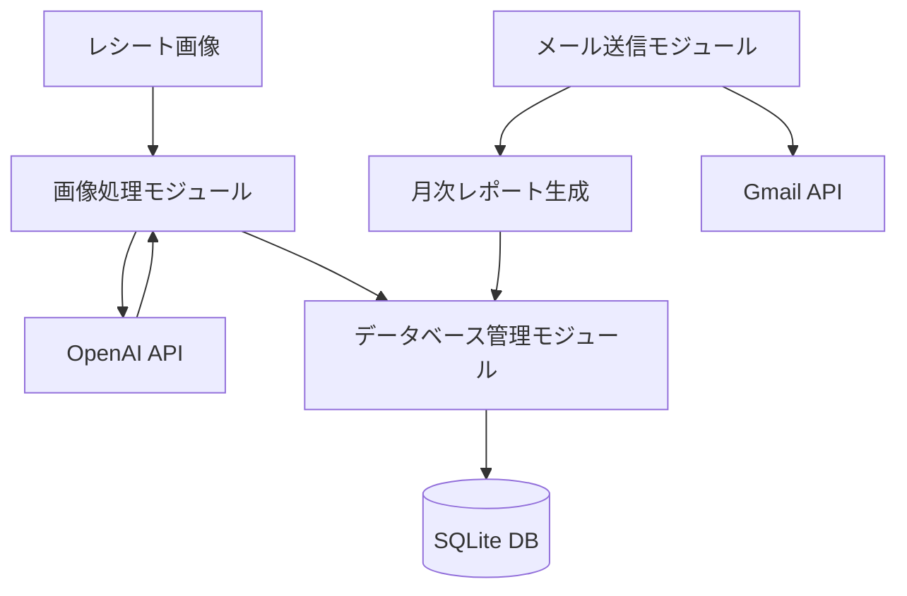

# 家計簿アプリケーション

レシート画像から情報を抽出し、データベースに保存して管理する家計簿アプリケーション

---

## プロジェクト概要

### 目的

- レシート管理の自動化
- 家計支出の可視化
- 月次レポートの自動生成と共有

### 主な機能

- レシート画像から店舗名と合計金額を抽出
- 抽出した情報をSQLiteデータベースに保存
- 月次レポートの生成と表示
- 月次レポートをメールで送信

---

## システム構成



---

## 使用技術

- **バックエンド**: Node.js, TypeScript
- **データベース**: SQLite
- **API連携**:
  - OpenAI API (GPT-4.1-mini) - レシート情報抽出
  - Gmail API - メール送信
- **その他**:
  - dotenv - 環境変数管理
  - table - コンソール出力のテーブル表示

---

## ファイル構成

```
kakei/
├── .env.sample        # 環境変数サンプル
├── credentials.json   # Gmail API認証情報
├── database.sqlite3/  # SQLiteデータベース
├── images/            # レシート画像保存ディレクトリ
├── src/               # ソースコード
│   ├── constants.ts   # 定数定義
│   ├── db.ts          # データベース操作
│   ├── index.ts       # メインエントリポイント
│   ├── monthly-mail.ts # 月次メール送信
│   ├── monthly-total.ts # 月次レポート生成
│   └── query.ts       # データベースクエリ
└── token.json         # Gmail APIトークン
```

---

## 主要機能① - レシート画像処理

### 処理フロー

1. コマンドラインから画像ファイルまたはディレクトリを指定
2. 画像をBase64エンコードしてOpenAI APIに送信
3. GPT-4.1-miniモデルがレシート情報を抽出
4. 抽出された情報（店舗名・合計金額）をCSV形式で取得
5. 画像のハッシュ値を生成して重複処理を防止
6. データベースに保存

--

### コード例: レシート情報抽出

```typescript
// OpenAI APIを使用してレシート情報を抽出
const response = await openai.responses.create({
  model: "gpt-4.1-mini",
  input: [
    {
      role: "user",
      content: [
        { type: "input_text", text: `アップロードされた画像がレシートかどうかを判断し...` },
        { type: "input_image", image_url: `data:image/jpeg;base64,${base64Image}` }
      ],
    },
  ],
});

// レスポンスからCSVデータを抽出
let csvData = responseText.replace(/^IS_RECEIPT: true\n/, '');
```

---

## 主要機能② - データベース管理

### データベース構造

- **receipts テーブル**: レシートの基本情報
  - id, image_hash, created_at
- **receipt_items テーブル**: レシートの詳細情報
  - id, image_hash, store_name, total_amount

--

### コード例: データベース操作

```typescript
// データベースの初期化
export function initializeDatabase(db: sqlite3.Database): void {
  db.serialize(() => {
    // receiptsテーブル - レシートの基本情報
    db.run(`
      CREATE TABLE IF NOT EXISTS receipts (
        id INTEGER PRIMARY KEY AUTOINCREMENT,
        image_hash TEXT UNIQUE NOT NULL,
        created_at TIMESTAMP DEFAULT CURRENT_TIMESTAMP
      )
    `);
    
    // receipt_itemsテーブル - レシートの詳細情報
    db.run(`
      CREATE TABLE IF NOT EXISTS receipt_items (
        id INTEGER PRIMARY KEY AUTOINCREMENT,
        image_hash TEXT NOT NULL,
        store_name TEXT NOT NULL,
        total_amount INTEGER NOT NULL,
        FOREIGN KEY (image_hash) REFERENCES receipts(image_hash)
      )
    `);
  });
}
```

---

## 主要機能③ - 月次レポート生成

### 機能概要

- 指定した年月のレシートデータを集計
- レシートごとの詳細情報を表示
- 月の合計金額を計算
- コンソールに整形して表示

--

### コード例: 月次レポート生成

```typescript
// 月次レポートの表示
async function main(): Promise<void> {
  // データベース接続を作成
  const db = createDatabaseConnection(DATABASE_PATH);
  
  try {
    // コマンドライン引数から年と月を取得
    const { year, month } = getYearMonthFromArgs();
    
    console.log(`=== ${year}年${getMonthName(month)}の家計簿 ===`);
    
    // 詳細情報を取得
    const details = await getMonthlyReceiptDetails(year, month, db);
    
    // レシートデータの表示処理...
    
    console.log(`${year}年${getMonthName(month)}の合計金額: ${details.total}円`);
  } catch (error) {
    console.error('エラー:', error);
  }
}
```

---

## 主要機能④ - メール送信

### 機能概要

- Gmail APIを使用してメールを送信
- 月次レポートをテーブル形式で整形
- 合計金額と請求金額（1/2を10円単位で切り下げ）を表示
- OAuth2認証を使用してGmail APIにアクセス

--

### コード例: メール送信

```typescript
// メールを送信する関数
async function sendEmail(auth: any, subject: string, messageText: string) {
  const gmail = google.gmail({version: 'v1', auth});
  
  // メールの作成
  const utf8Subject = `=?utf-8?B?${Buffer.from(subject).toString('base64')}?=`;
  const messageParts = [
    'From: me',
    `To: ${TO_EMAIL}`,
    'Content-Type: text/plain; charset=utf-8',
    'MIME-Version: 1.0',
    `Subject: ${utf8Subject}`,
    '',
    messageText,
  ];
  const message = messageParts.join('\n');

  // Base64エンコード
  const encodedMessage = Buffer.from(message)
    .toString('base64')
    .replace(/\+/g, '-')
    .replace(/\//g, '_')
    .replace(/=+$/, '');

  // メール送信
  const res = await gmail.users.messages.send({
    userId: 'me',
    requestBody: {
      raw: encodedMessage,
    },
  });
}
```

---

## 使用方法

### レシート画像の処理

```bash
npm run dev -- ./images/receipt.jpg  # 単一の画像を処理
npm run dev -- ./images              # ディレクトリ内のすべての画像を処理
```

### 月次レポートの表示

```bash
npm run monthly                # 現在の月のレポートを表示
npm run monthly -- 2025-05     # 2025年5月のレポートを表示
npm run monthly -- 2025 4      # 2025年4月のレポートを表示
```

### 月次レポートのメール送信

```bash
npm run monthly-mail           # 現在の月のレポートをメールで送信
npm run monthly-mail -- 2025-05 # 2025年5月のレポートをメールで送信
```

---

## セットアップ手順

1. リポジトリをクローン
   ```bash
   git clone <repository-url>
   cd kakei
   ```

2. 依存パッケージをインストール
   ```bash
   npm install
   ```

3. 環境変数の設定
   ```bash
   cp .env.sample .env
   # .envファイルを編集して必要な情報を設定
   ```

4. TypeScriptのコンパイル
   ```bash
   npm run build
   ```

---

## 環境変数の設定

### OpenAI API設定
- `OPENAI_API_KEY`: OpenAI APIのキー（レシート情報の抽出に使用）

### Gmail API設定
- `GMAIL_TOKEN_PATH`: Gmailトークンファイルのパス（デフォルト: `token.json`）
- `GMAIL_CREDENTIALS_PATH`: Gmail認証情報ファイルのパス（デフォルト: `credentials.json`）
- `GMAIL_TO_EMAIL`: 月次レポートの送信先メールアドレス

---

## 今後の展望

- Webインターフェースの追加
- 支出カテゴリの自動分類
- グラフによるデータ可視化
- 予算管理機能の追加
- モバイルアプリ対応

---

## まとめ

- レシート画像から情報を自動抽出する家計簿アプリケーション
- OpenAI APIとGmail APIを活用
- SQLiteデータベースで情報を管理
- 月次レポートの自動生成とメール送信
- コマンドラインで簡単に操作可能

---

# ご清聴ありがとうございました

質問やフィードバックをお待ちしています
